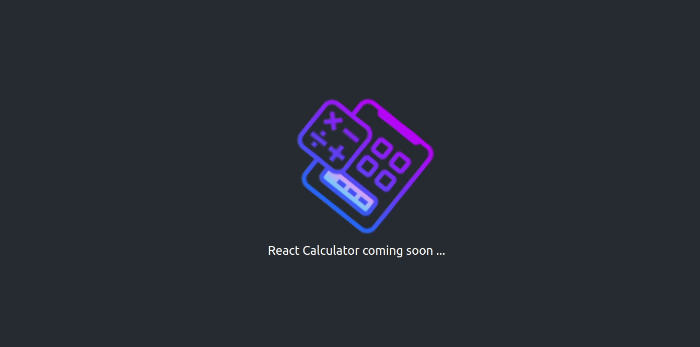

[![Contributors][contributors-shield]][contributors-url]
[![Forks][forks-shield]][forks-url]
[![Stargazers][stars-shield]][stars-url]
[![Issues][issues-shield]][issues-url]

<!-- PROJECT LOGO -->
<br />
<p align="center">
    

  <h3 align="center">REACT CALCULATOR APP</h3>

  <p align="center">
    A web App created in the fulfillment of Microverse React Milestone projects
    <br />
    <a href="https://afritrend.herokuapp.com/users/sign_in">View Demo</a>
    ·
    <a href="https://github.com/Cyrus-Kiprop/afriTrend/issues">Report Bug</a>
    ·
    <a href="https://github.com/Cyrus-Kiprop/afriTrend/issues">Request Feature</a>
  </p>
</p>

<!-- TABLE OF CONTENTS -->

## Table of Contents

- [About the Project](#about-the-project)
  - [Live Demo](#live-demo)
  - [Built With](#built-with)
- [Getting Started](#getting-started)
  - [Prerequisites](#prerequisites)
  - [Installation](#installation)
  - [Deployment](#Deployment)
- [Usage](#usage)
- [Roadmap](#roadmap)
- [Contributing](#contributing)
- [License](#license)
- [Contact](#contact)
- [Acknowledgements](#acknowledgements)

<!-- ABOUT THE PROJECT -->

## About The Project



A simple React Calculator with basic to advanced mathematical operations.

This project was bootstrapped with [Create React App](https://github.com/facebook/create-react-app).

## Live Demo

Click [ here ](https://nxt-gen-calculator.herokuapp.com/) for a live demo of the app.

### Built With

The project was built using the following languages stacks:

```sh
Back-End(server)
```

N/A

```sh
Front-End(client)
```

- [Bootstrap v 4](https://getbootstrap.com)
- React.js
- Javascript/ES6
- Create-react-app (scaffolding the project)
- [Font Awesome Icons](https://fontawesome.com/icons?d=gallery)

```sh
Testing Frameworks
```

- Jest

<!-- GETTING STARTED -->

## Getting Started

To get a local copy up and running follow these simple example steps.

### Prerequisites

- [Heroku](https://www.heroku.com/)
  - [command line tools](https://devcenter.heroku.com/articles/heroku-cli)
  - [a free account](https://id.heroku.com/)
- git
- Node.js
- create-react-app

### Installation

1. Clone the repo

```sh
git clone https://github.com/Cyrus-Kiprop/react-calculatort
```

2. CD into the project root directory

```sh
cd ./react-calculator
```

3. Install npm packages

```sh
yarn
```

4. Set the databases

### Deployment

Check out this awesome documentation for heroku deployment: https://github.com/mars/create-react-app-buildpack

<!-- USAGE EXAMPLES -->

## Usage


### Some useful scripts

In the project directory, you can run:

```JS
yarn start
```
Runs the app in the development mode.<br />

```JS
http//localhost:3000
```

Open [http://localhost:3000](http://localhost:3000) to view it in the browser.

The page will reload if you make edits.<br />
You will also see any lint errors in the console.

```JS
yarn test
```

Launches the test runner in the interactive watch mode.<br />
See the section about [running tests](https://facebook.github.io/create-react-app/docs/running-tests) for more information.

```JS
yarn build
```

Builds the app for production to the `build` folder.<br />
It correctly bundles React in production mode and optimizes the build for the best performance.

The build is minified and the filenames include the hashes.<br />
Your app is ready to be deployed!

```JS
yarn eject
```

**Note: this is a one-way operation. Once you `eject`, you can’t go back!**

If you aren’t satisfied with the build tool and configuration choices, you can `eject` at any time. This command will remove the single build dependency from your project.

Instead, it will copy all the configuration files and the transitive dependencies (webpack, Babel, ESLint, etc) right into your project so you have full control over them. All of the commands except `eject` will still work, but they will point to the copied scripts so you can tweak them. At this point you’re on your own.

You don’t have to ever use `eject`. The curated feature set is suitable for small and middle deployments, and you shouldn’t feel obligated to use this feature. However we understand that this tool wouldn’t be useful if you couldn’t customize it when you are ready for it.

crunch some complex maths

<!-- ROADMAP -->

## Roadmap

See the [open issues](https://github.com/Cyrus-Kiprop/react-calculator/issues?q=is%3Aissue+is%3Aopen+sort%3Aupdated-desc) for a list of proposed features (and known issues).

<!-- CONTRIBUTING -->

## Contributing

Contributions are what make the open source community such an amazing place to be learn, inspire, and create. Any contributions you make are **greatly appreciated**.

1. Fork the Project
2. Create your Feature Branch (`git checkout -b feature/NewAwesomeFeature`)
3. Commit your Changes (`git commit -m 'Add some NewAmazingFeature'`)
4. Push to the Branch (`git push origin feature/NewAmazingFeature`)
5. Open a Pull Request

<!-- CONTACT -->

## Contact

Cyrus Kiprop - cyruskiprop254@gmail.com

Project Link: [https://github.com/Cyrus-Kiprop/afriTrend](https://github.com/Cyrus-Kiprop/afriTrend)

## Authors

👤 **Cyrus Kiprop**

- Github: [Cyrus-Kiprop](https://github.com/Cyrus-Kiprop)
- Twitter: [@kipropJS](https://twitter.com/kipropJS)
- Linkedin: [Cyrus Kiprop](https://www.linkedin.com/in/cyrus-kiprop-ba7320120/)

## Acknowledgements

- [Heroku](https://www.heroku.com/)
- [icons8](https://icons8.com/)
- [Best-README-Template](https://github.com/othneildrew/Best-README-Template)

<!-- LICENSE -->

## License

Distributed under the MIT License. See [ LICENSE ](https://github.com/Cyrus-Kiprop/react-calculator/raw/develop/LICENSE) for more information.

<!-- MARKDOWN LINKS & IMAGES -->

[contributors-shield]: https://img.shields.io/github/contributors/Cyrus-Kiprop/react-calculator.svg?style=flat-square
[contributors-url]: https://github.com/Cyrus-Kiprop/react-calculator/graphs/contributors
[forks-shield]: https://img.shields.io/github/forks/Cyrus-Kiprop/react-calculator.svg?style=flat-square
[forks-url]: https://github.com/Cyrus-Kiprop/react-calculator/network/members
[stars-shield]: https://img.shields.io/github/stars/Cyrus-Kiprop/react-calculator.svg?style=flat-square
[stars-url]: https://github.com/Cyrus-Kiprop/react-calculator/stargazers
[issues-shield]: https://img.shields.io/github/issues/Cyrus-Kiprop/react-calculator.svg?style=flat-square
[issues-url]: https://github.com/Cyrus-Kiprop/react-calculator/issues
[product-screenshot]: /images/screenshot.png